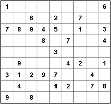
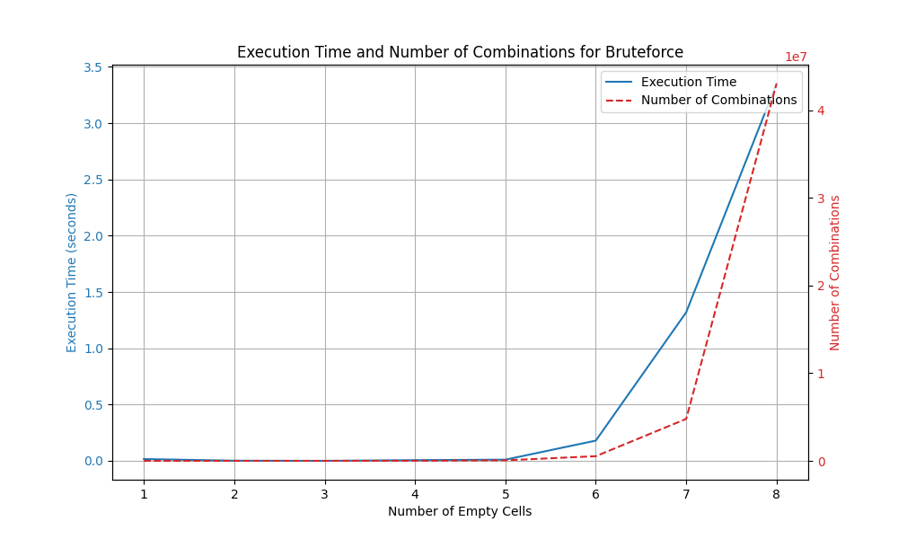
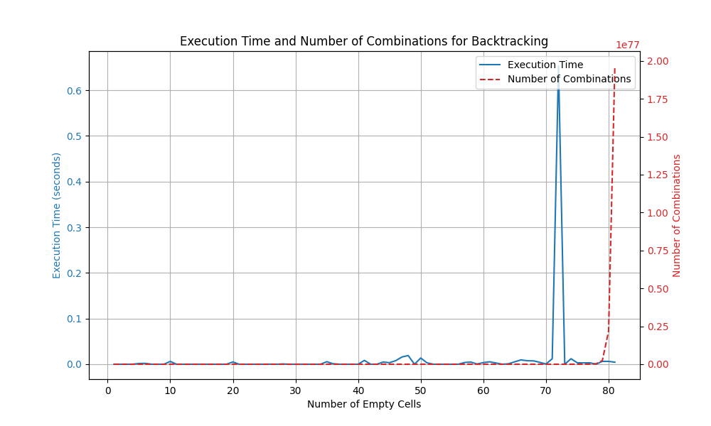
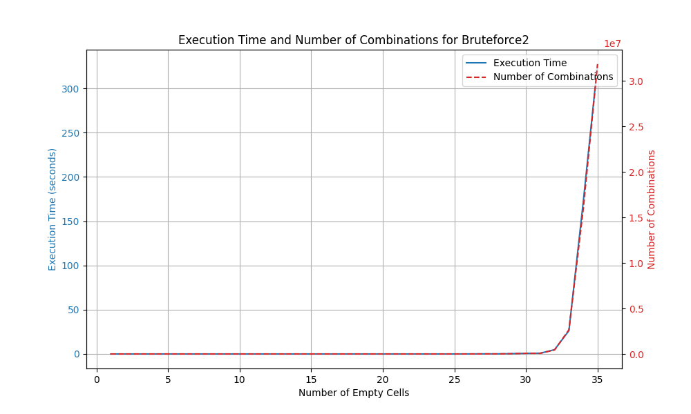
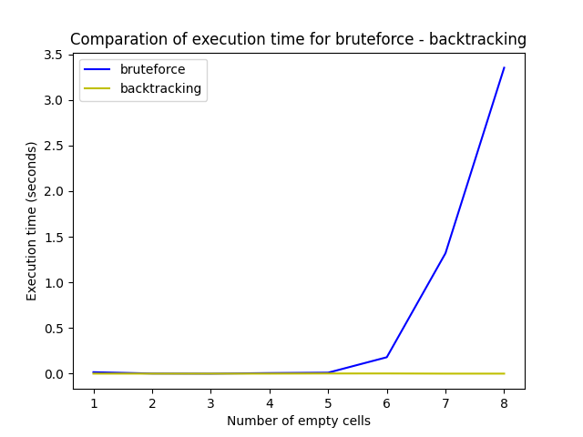
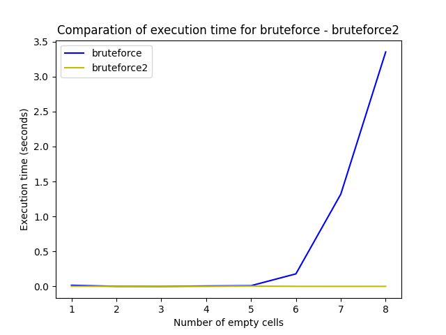
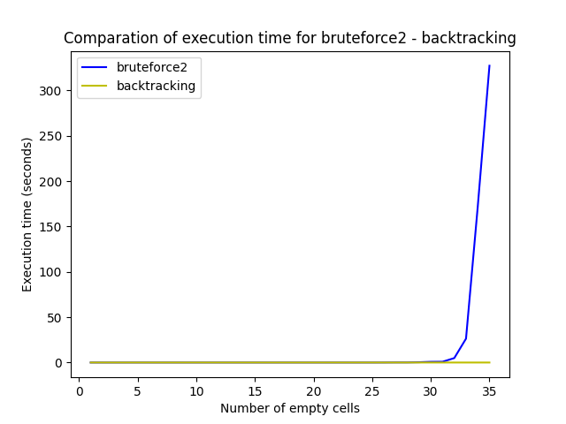

# Sudoku-Solver
A Sudoku Solver using Brute Force and Backtracking

## Install the project and launch the application
### To install (once only)
- Open git bash where you want to install
- Type commands :
  - `git clone https://github.com/christian-aucane/Sudoku-Solver.git`
  - `cd Sudoku-Solver`
  - `source bash_scripts/init.bash`
### To launch the application (each time it is launched)
- Open git bash at project root
- Type command :
  - `source bash_scripts/run.bash`

## TODO

### Section Analyse dans le README
- Nombre de combinaisons exponentielle OK
- calcul du nombre de combinaisons selon le nombre de case vide OK
- Calcul de la complexité algorithmique
- comparaison des algos
- graphiques
- ...? 

### Autre methode de resolution
- calculer valeurs possibles de chaque case
- dans les cases ou une seule posibilité mettre la valeur
- recalculer
- est-ce que ca marche ?
- si non trouver que faire des valeurs possibles

## Files

### solvers/
#### base.py
##### BaseSudokuSolver
Base class for all solvers
##### BaseBruteforceSudokuSolver
Inherits from BaseSudokuSolver
Base class for solvers using the bruteforce method

#### backtracking.py
##### BacktrackingSudokuSolver
Inherits from BaseSudokuSolver
Solver using the backtracking method

#### bruteforce.py
##### BruteforceSudokuSolver
Inherits from BaseBruteforceSudokuSolver
Solver using the "classic" bruteforce method (tests all possible values from 1 to 9 in each cell)

#### bruteforce2.py
##### Bruteforce2SudokuSolver
Inherits from BaseBruteforceSudokuSolver
Improved bruteforce solver (tests only possible values for each cell)

### app.py (REQUIRES TO FIRST LAUNCH generate_grids.py)
Launch program

### utils.py
Contains all the code used in several other files
- Folder paths
- count_empty_cells(grid) -> Returns the number of life cells in the grid
- read_file(file_path) -> Reads a file and returns the grid
- get_solver_class(method) -> Returns the solver class corresponding to a method
- generate_grid(input_grid, num_empty_cells) -> Returns a copy of input_grid with num_empty_cells empty cells

### generate_grids.py
Generates grids for each solving method

### generate_stats.py (REQUIRES TO FIRST LAUNCH generate_grids.py)
Generates a JSON file containing the execution times of the different solving methods for different numbers of empty cells (same grid, with one additional cell removed each round).
#### Argument
- method (optionnel) -> Solving method to test

### generate_graphs.py (REQUIRES TO FIRST LAUNCH generate_stats.py)
Generates graphs for each solving method (uses matplotlib)

### show_graphs.py (REQUIRES TO FIRST LAUNCH generate_stats.py)
Displays interactive graphs for each solving method (uses plotly)
#### Argument
- method (optionnel) -> Solving method to display

## Analyse
Le nombre de combinaisons possibles augmente de manière exponentiel par rapport au nombre de cases vides
- 1 case : 9 combinaisons
- 2 cases : 9^2 = 81 combinaisons
- 3 cases : 9^3 = 729 combinaisons
- 4 cases : 9^4 = 6561 combinaison
- 5 cases : 9^5 = 95 049 combinaison
- 6 cases : 9^6 = 531 441 combinaison
- 7 cases : 9^7 = 4 782 969 combinaison
- 8 cases : 9^8 = 43 046 721 combinaison
- 9 cases : 9^9 = 387 420 489 combinaison
- ...

### Rappel des règles

Chaque ligne, colonne et région 3 x 3 doivent contenir tous les chiffres de 1 a 9 une seule fois.

### Bruteforce
#### Explication de l'algoritgme

#### Graphique

### Backtracking
#### Explication de l'algoritgme
Backtracking is a method to systematically explore all possible solutions to a problem, making it effective in Sudoku solving by ensuring game rules are followed. This Sudoku solver employs a backtracking algorithm based on the BaseSudokuSolver class, promoting organized code. The 'solve()' method initiates the solving process, displaying puzzle complexity before calling 'solverecursive()'. Within 'solverecursive()', each possibility is tested recursively, backtracking if a contradiction is found, until a solution is reached or all possibilities are exhausted. This efficient approach provides a practical solution for Sudoku enthusiasts.

#### Graphique

### Bruteforce avec sélection des valeurs (bruteforce2)
#### Explication de l'algoritgme
Comparable au bruteforce, sauf qu'au lieu de tester toutes les valeurs de 1 a 9 pour chaque case, il calcule d'abord les valeurs possibles pour chaque case, c'est a dire qui ne violent pas les règles du Sudoku, ensuite teste toutes les combinaisons de valeurs possibles.
Le nombre de combinaisons dépend de la grille. En effet, selon la position des cases vides il n'y a pas forcément le même nombre de combinaisons.
#### Graphique

### Comparaisons

Dans l'ordre, l'algorithme le plus rapide est le **backtracking**, suivi par le **bruteforce avec sélection des valeurs**, puis par le **bruteforce**.
- Pour le **bruteforce** le temps de résolution reste raisonable jusqu'a 8 cases vides (autours de 3 secondes).
- Pour le **bruteforce** avec sélection Le temps de résolution reste raisonable entre 30 et 35 cases vides (Ca dépend de la grille).
- Pour le **backtracking**, le temps de résolution reste très raisonable quelque soit le nombre de cases vides (moins d'1 seconde)

### Conclusion
Pour résoudre une grille normale, il faut utiliser le backtracking.
